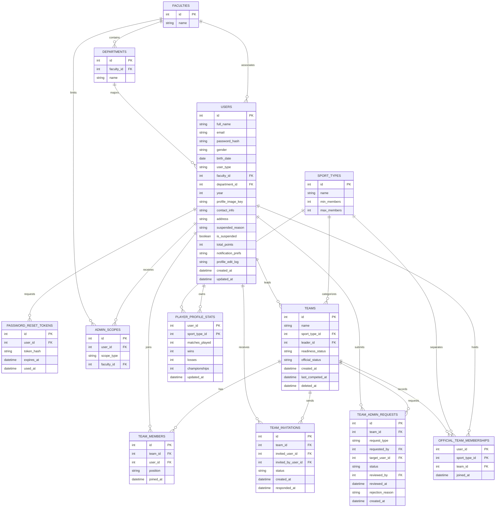
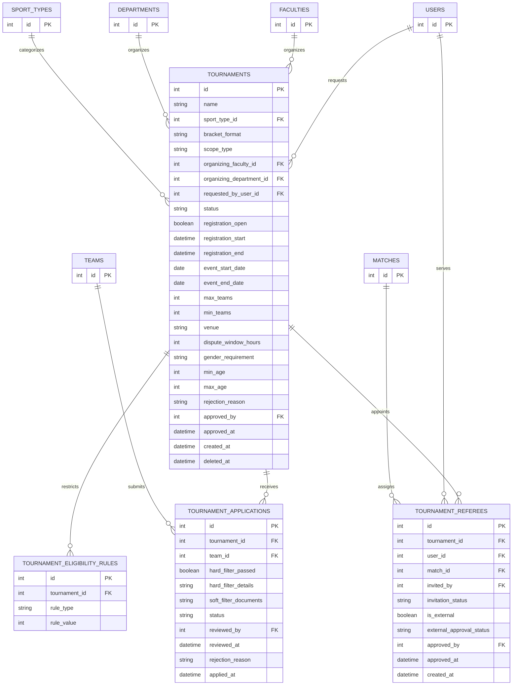
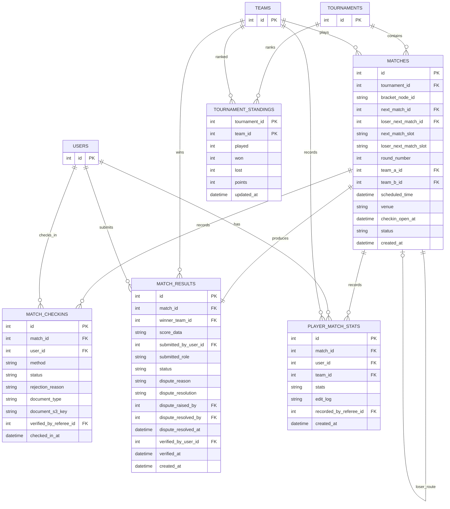
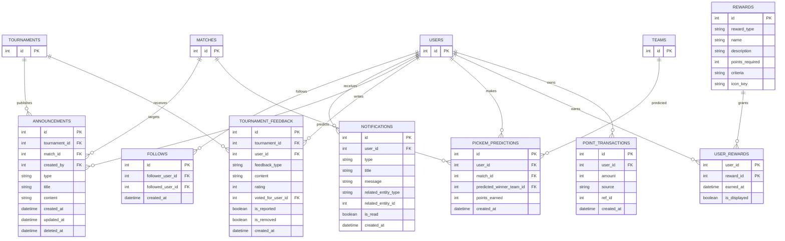
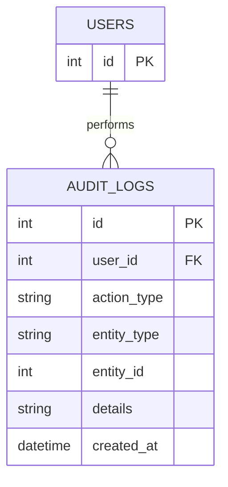
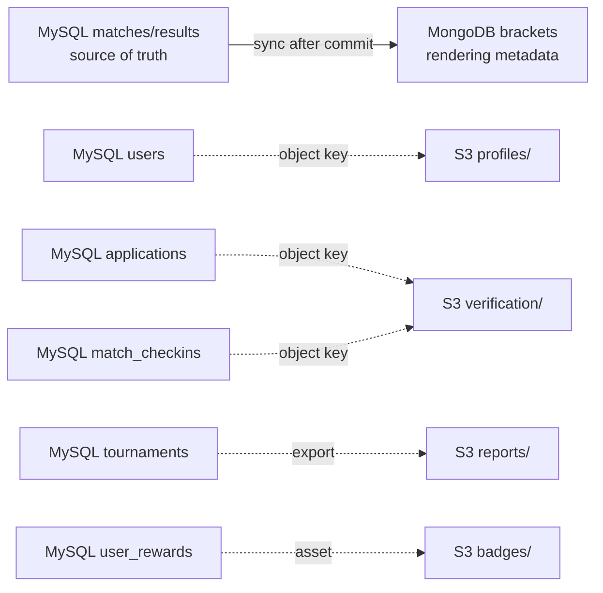

# แผนภาพ ERD ฐานข้อมูล LTMS — ฉบับแปลเพื่อความเข้าใจ

[กลับไปยังดัชนีเอกสาร](README.md) · [English ERD source](LTMS_Database_ERD.md) · [ฐานข้อมูลฉบับหลัก](LTMS_Database_Design.md)

ไฟล์นี้เป็นฉบับภาษาไทยของ ERD ภาษาอังกฤษ โดยคงโครงสร้าง diagram และ field catalog เหมือนกันทั้งหมด แปลเฉพาะหัวข้อและคำอธิบายเพื่อช่วยให้สมาชิกในกลุ่มเข้าใจภาพรวมได้ง่ายขึ้น ส่วน LTMS_Database_ERD.md เป็น source of truth ของ ERD และ LTMS_Database_Design.md เป็น source หลักของ SQL, field definitions, constraints, lifecycle rules และการตัดสินใจระหว่างฐานข้อมูล

แผนภาพแบ่งตาม domain เพื่อให้เห็น MySQL ครบทั้ง 30 ตารางโดยไม่แน่นเกินไป ตาราง context อาจปรากฏซ้ำเพื่อแสดงความสัมพันธ์ข้าม domain แต่รายละเอียดและจำนวนตารางยังเหมือนกับฉบับภาษาอังกฤษ

## 1. ผู้ใช้ องค์กร และทีม — 12 ตาราง

`PLAYER_PROFILE_STATS` และ `OFFICIAL_TEAM_MEMBERSHIPS` ใช้ composite primary key: `(user_id, sport_type_id)`

## 2. Tournament, eligibility, Official และการสมัคร — 4 ตาราง

ตาราง context ที่อยู่ด้านบนของ diagram นี้แสดงแบบย่อ รายละเอียด fields ทั้งหมดอยู่ใน section 1 หรือ section 3

## 3. Match, ผลการแข่งขัน, check-in และ standings — 5 ตาราง

`MATCH_RESULTS.winner_team_id` เป็นแหล่งข้อมูลผู้ชนะที่ยืนยันแล้ว ส่วน `MATCHES.next_match_id` และ `MATCHES.loser_next_match_id` ใช้กำหนดเส้นทาง และ slot columns ใช้ระบุว่าปลายทางคือ `team_a` หรือ `team_b`

## 4. Engagement, การรับชม และ Pick'em — 8 ตาราง

ปัจจุบัน `TOURNAMENT_FEEDBACK` รวม comments, organizer feedback และ MVP votes ไว้ด้วยกัน กฎ one-vote-per-user-per-tournament ยังเป็น application-level TODO จนกว่าจะอนุมัติ constraint/table เฉพาะ

## 5. Audit — 1 ตาราง

## 6. การแบ่งหน้าที่ของ MongoDB และ S3

MongoDB และ S3 ไม่ได้ใช้แทน relational tables โดย MongoDB เก็บ Bracket projection ที่สามารถสร้างใหม่ได้ ส่วน S3 เก็บ private หรือ public objects ตาม retention และ access policy ขณะที่ MySQL เก็บ references และ business metadata

## 7. รายการตารางหลักทั้งหมด

MySQL มีตารางทั้งหมด 30 ตาราง:

`faculties`, `departments`, `sport_types`, `users`, `password_reset_tokens`, `admin_scopes`, `teams`, `team_members`, `team_invitations`, `team_admin_requests`, `player_profile_stats`, `official_team_memberships`, `tournaments`, `tournament_eligibility_rules`, `tournament_referees`, `tournament_applications`, `matches`, `match_checkins`, `match_results`, `player_match_stats`, `tournament_standings`, `follows`, `notifications`, `announcements`, `tournament_feedback`, `pickem_predictions`, `rewards`, `user_rewards`, `point_transactions`, and `audit_logs`.

## 8. Field catalog — ผู้ใช้ องค์กร และทีม

ตารางด้านล่างเป็นมุมมองย่อสำหรับอ่าน SQL โดย `PK` และ `FK` ใช้ระบุ keys, `UK` ใช้ระบุ unique constraint และ `—` หมายถึงไม่ได้แสดง default หรือ key rule พิเศษในส่วนนี้

| Table | Column | Data type | Key | Nullable / default / value | Description |
| --- | --- | --- | --- | --- | --- |
| faculties | id | INT | PK | AUTO_INCREMENT | Faculty identifier |
| faculties | name | VARCHAR(150) | — | NOT NULL | Faculty name |
| departments | id | INT | PK | AUTO_INCREMENT | Department identifier |
| departments | faculty_id | INT | FK | NOT NULL | References faculties.id |
| departments | name | VARCHAR(150) | — | NOT NULL | Department name |
| sport_types | id | INT | PK | AUTO_INCREMENT | Sport identifier |
| sport_types | name | VARCHAR(100) | — | NOT NULL | Sport name |
| sport_types | min_members | INT | — | NOT NULL | Minimum roster size |
| sport_types | max_members | INT | — | NOT NULL | Maximum roster size |
| users | id | INT | PK | AUTO_INCREMENT | User identifier |
| users | full_name | VARCHAR(150) | — | NOT NULL | Display name |
| users | email | VARCHAR(150) | UK | NOT NULL | Login email |
| users | password_hash | VARCHAR(255) | — | NOT NULL | Salted password hash |
| users | gender | ENUM | — | NOT NULL: male/female/other | Eligibility attribute |
| users | birth_date | DATE | — | NOT NULL | Eligibility attribute |
| users | user_type | ENUM | — | NOT NULL: student/staff/external | Base identity type |
| users | faculty_id | INT | FK | NULL | Home faculty |
| users | department_id | INT | FK | NULL | Home department |
| users | year | INT | — | NULL | Student year |
| users | profile_image_key | VARCHAR(255) | — | NULL | S3 object key |
| users | contact_info | VARCHAR(255) | — | NULL | Contact details |
| users | address | TEXT | — | NULL | Address |
| users | is_suspended | BOOLEAN | — | NOT NULL DEFAULT FALSE | Account suspension state |
| users | suspended_reason | TEXT | — | NULL | Suspension reason |
| users | total_points | INT | — | NOT NULL DEFAULT 0 | Cached Pick'em points |
| users | notification_prefs | JSON | — | NULL | Notification settings |
| users | profile_edit_log | JSON | — | NULL | Profile edit history |
| users | created_at | DATETIME | — | CURRENT_TIMESTAMP | Creation time |
| users | updated_at | DATETIME | — | NULL | Last update time |
| password_reset_tokens | id | INT | PK | AUTO_INCREMENT | Token record identifier |
| password_reset_tokens | user_id | INT | FK | NOT NULL | References users.id |
| password_reset_tokens | token_hash | VARCHAR(255) | — | NOT NULL | Hashed reset token |
| password_reset_tokens | expires_at | DATETIME | — | NOT NULL | Expiration time |
| password_reset_tokens | used_at | DATETIME | — | NULL | Consumption time |
| admin_scopes | id | INT | PK | AUTO_INCREMENT | Scope record identifier |
| admin_scopes | user_id | INT | FK | NOT NULL | Administrator |
| admin_scopes | scope_type | ENUM | — | NOT NULL: faculty/university_wide | Administrative scope |
| admin_scopes | faculty_id | INT | FK | NULL | Faculty scope when applicable |
| teams | id | INT | PK | AUTO_INCREMENT | Team identifier |
| teams | name | VARCHAR(150) | UK | NOT NULL | Unique with sport_type_id |
| teams | sport_type_id | INT | FK | NOT NULL | Team sport |
| teams | leader_id | INT | FK | NOT NULL | Team Manager |
| teams | readiness_status | ENUM | — | NOT NULL DEFAULT Forming | Forming or Ready |
| teams | official_status | ENUM | — | NOT NULL DEFAULT Unofficial | Official or Unofficial |
| teams | created_at | DATETIME | — | CURRENT_TIMESTAMP | Creation time |
| teams | last_competed_at | DATETIME | — | NULL | Last competition time |
| teams | deleted_at | DATETIME | — | NULL | Pre-competition deletion marker |
| team_members | id | INT | PK | AUTO_INCREMENT | Membership identifier |
| team_members | team_id | INT | FK | NOT NULL | Team |
| team_members | user_id | INT | FK | NOT NULL | Member |
| team_members | position | ENUM | — | NOT NULL DEFAULT starter | Starter or substitute |
| team_members | joined_at | DATETIME | — | CURRENT_TIMESTAMP | Join time |
| team_members | team_id + user_id | — | UK | Unique pair | One active membership pair |
| team_invitations | id | INT | PK | AUTO_INCREMENT | Invitation identifier |
| team_invitations | team_id | INT | FK | NOT NULL | Team |
| team_invitations | invited_user_id | INT | FK | NOT NULL | Invitee |
| team_invitations | invited_by_user_id | INT | FK | NOT NULL | Inviter |
| team_invitations | status | ENUM | — | NOT NULL DEFAULT pending | pending/accepted/rejected/expired |
| team_invitations | created_at | DATETIME | — | CURRENT_TIMESTAMP | Creation time |
| team_invitations | responded_at | DATETIME | — | NULL | Response time |
| team_admin_requests | id | INT | PK | AUTO_INCREMENT | Request identifier |
| team_admin_requests | team_id | INT | FK | NOT NULL | Team |
| team_admin_requests | request_type | ENUM | — | NOT NULL: official_status/leader_transfer | Request kind |
| team_admin_requests | requested_by | INT | FK | NOT NULL | Requester |
| team_admin_requests | target_user_id | INT | FK | NULL | New leader when applicable |
| team_admin_requests | status | ENUM | — | NOT NULL DEFAULT pending | pending/approved/rejected |
| team_admin_requests | reviewed_by | INT | FK | NULL | Reviewing administrator |
| team_admin_requests | reviewed_at | DATETIME | — | NULL | Review time |
| team_admin_requests | rejection_reason | TEXT | — | NULL | Rejection reason |
| team_admin_requests | created_at | DATETIME | — | CURRENT_TIMESTAMP | Creation time |
| player_profile_stats | user_id | INT | PK+FK | Composite PK with sport_type_id | Athlete |
| player_profile_stats | sport_type_id | INT | PK+FK | Composite PK with user_id | Sport |
| player_profile_stats | matches_played | INT | — | DEFAULT 0 | Confirmed match count |
| player_profile_stats | wins | INT | — | DEFAULT 0 | Confirmed wins |
| player_profile_stats | losses | INT | — | DEFAULT 0 | Confirmed losses |
| player_profile_stats | championships | INT | — | DEFAULT 0 | Championships |
| player_profile_stats | updated_at | DATETIME | — | CURRENT_TIMESTAMP | Last recalculation |
| official_team_memberships | user_id | INT | PK+FK | Composite PK with sport_type_id | Athlete |
| official_team_memberships | sport_type_id | INT | PK+FK | Composite PK with user_id | Sport |
| official_team_memberships | team_id | INT | FK | NOT NULL | Official team |
| official_team_memberships | joined_at | DATETIME | — | CURRENT_TIMESTAMP | Membership time |

## 9. Field catalog — Tournament และการสมัคร

| Table | Column | Data type | Key | Nullable / default / value | Description |
| --- | --- | --- | --- | --- | --- |
| tournaments | id | INT | PK | AUTO_INCREMENT | Tournament identifier |
| tournaments | name | VARCHAR(200) | — | NOT NULL | Tournament name |
| tournaments | sport_type_id | INT | FK | NOT NULL | Sport |
| tournaments | bracket_format | ENUM | — | NULL: single/double/round_robin | Competition format |
| tournaments | scope_type | ENUM | — | NOT NULL: department/faculty/university | Visibility scope |
| tournaments | organizing_faculty_id | INT | FK | NULL | Organizing faculty |
| tournaments | organizing_department_id | INT | FK | NULL | Organizing department |
| tournaments | requested_by_user_id | INT | FK | NOT NULL | Requester/contextual Organizer |
| tournaments | status | ENUM | — | NOT NULL DEFAULT pending_approval | pending_approval/rejected/private/public/completed/auto_deleted |
| tournaments | registration_open | BOOLEAN | — | NOT NULL DEFAULT FALSE | Registration state |
| tournaments | registration_start | DATETIME | — | NULL | Registration opening |
| tournaments | registration_end | DATETIME | — | NULL | Registration closing |
| tournaments | event_start_date | DATE | — | NOT NULL | Competition start |
| tournaments | event_end_date | DATE | — | NULL | Competition end |
| tournaments | max_teams | INT | — | NOT NULL | Capacity upper bound |
| tournaments | min_teams | INT | — | NOT NULL | Capacity lower bound |
| tournaments | venue | VARCHAR(255) | — | NULL | Venue or online channel |
| tournaments | dispute_window_hours | INT | — | DEFAULT 24 | Result dispute window |
| tournaments | gender_requirement | ENUM | — | DEFAULT any | any/male/female |
| tournaments | min_age | INT | — | NULL | Minimum age |
| tournaments | max_age | INT | — | NULL | Maximum age |
| tournaments | rejection_reason | TEXT | — | NULL | Request rejection reason |
| tournaments | approved_by | INT | FK | NULL | Approving administrator |
| tournaments | approved_at | DATETIME | — | NULL | Approval time |
| tournaments | created_at | DATETIME | — | CURRENT_TIMESTAMP | Creation time |
| tournaments | deleted_at | DATETIME | — | NULL | Deletion marker |
| tournament_eligibility_rules | id | INT | PK | AUTO_INCREMENT | Rule identifier |
| tournament_eligibility_rules | tournament_id | INT | FK | NOT NULL | Tournament |
| tournament_eligibility_rules | rule_type | ENUM | — | NOT NULL: year/faculty | Rule kind |
| tournament_eligibility_rules | rule_value | INT | — | NOT NULL | Year or faculty id |
| tournament_eligibility_rules | tournament_id + rule_type + rule_value | — | UK | Unique rule | Prevents duplicate rule |
| tournament_referees | id | INT | PK | AUTO_INCREMENT | Assignment identifier |
| tournament_referees | tournament_id | INT | FK | NOT NULL | Tournament |
| tournament_referees | user_id | INT | FK | NOT NULL | Official |
| tournament_referees | match_id | INT | FK | NULL | Match assignment |
| tournament_referees | invited_by | INT | FK | NOT NULL | Inviter |
| tournament_referees | invitation_status | ENUM | — | DEFAULT pending | pending/accepted/rejected |
| tournament_referees | is_external | BOOLEAN | — | DEFAULT FALSE | External Official flag |
| tournament_referees | external_approval_status | ENUM | — | DEFAULT not_required | External approval state |
| tournament_referees | approved_by | INT | FK | NULL | Approver |
| tournament_referees | approved_at | DATETIME | — | NULL | Approval time |
| tournament_referees | created_at | DATETIME | — | CURRENT_TIMESTAMP | Creation time |
| tournament_applications | id | INT | PK | AUTO_INCREMENT | Application identifier |
| tournament_applications | tournament_id | INT | FK | NOT NULL | Tournament |
| tournament_applications | team_id | INT | FK | NOT NULL | Applying team |
| tournament_applications | hard_filter_passed | BOOLEAN | — | NULL | Hard-filter result |
| tournament_applications | hard_filter_details | JSON | — | NULL | Hard-filter evidence/details |
| tournament_applications | soft_filter_documents | JSON | — | NULL | S3 document references |
| tournament_applications | status | ENUM | — | DEFAULT pending | pending/approved/rejected/withdrawn |
| tournament_applications | reviewed_by | INT | FK | NULL | Reviewing Organizer |
| tournament_applications | reviewed_at | DATETIME | — | NULL | Review time |
| tournament_applications | rejection_reason | TEXT | — | NULL | Rejection reason |
| tournament_applications | applied_at | DATETIME | — | CURRENT_TIMESTAMP | Application time |
| tournament_applications | tournament_id + team_id | — | UK | Unique pair | One application per team |

## 10. Field catalog — Match, ผลการแข่งขัน และ standings

| Table | Column | Data type | Key | Nullable / default / value | Description |
| --- | --- | --- | --- | --- | --- |
| matches | id | INT | PK | AUTO_INCREMENT | Match identifier |
| matches | tournament_id | INT | FK | NOT NULL | Tournament |
| matches | bracket_node_id | VARCHAR(50) | — | NULL | MongoDB rendering node |
| matches | next_match_id | INT | FK | NULL | Winner destination |
| matches | loser_next_match_id | INT | FK | NULL | Loser destination |
| matches | next_match_slot | ENUM | — | NULL: team_a/team_b | Winner destination slot |
| matches | loser_next_match_slot | ENUM | — | NULL: team_a/team_b | Loser destination slot |
| matches | round_number | INT | — | NULL | Bracket/round number |
| matches | team_a_id | INT | FK | NULL | First participant |
| matches | team_b_id | INT | FK | NULL | Second participant |
| matches | scheduled_time | DATETIME | — | NULL | Scheduled time |
| matches | venue | VARCHAR(255) | — | NULL | Match venue/channel |
| matches | checkin_open_at | DATETIME | — | NULL | Check-in opening |
| matches | status | ENUM | — | DEFAULT scheduled | scheduled/checkin_open/in_progress/completed/disputed |
| matches | created_at | DATETIME | — | CURRENT_TIMESTAMP | Creation time |
| match_checkins | id | INT | PK | AUTO_INCREMENT | Check-in identifier |
| match_checkins | match_id | INT | FK | NOT NULL | Match |
| match_checkins | user_id | INT | FK | NOT NULL | Athlete |
| match_checkins | method | ENUM | — | NOT NULL | qr_onsite/photo_online/manual_by_referee |
| match_checkins | status | ENUM | — | NOT NULL | success/rejected/exception |
| match_checkins | rejection_reason | VARCHAR(255) | — | NULL | Rejection reason |
| match_checkins | document_type | ENUM | — | NULL | student_id/national_id |
| match_checkins | document_s3_key | VARCHAR(255) | — | NULL | Evidence object key |
| match_checkins | verified_by_referee_id | INT | FK | NULL | Verifying Official |
| match_checkins | checked_in_at | DATETIME | — | CURRENT_TIMESTAMP | Check-in time |
| match_results | id | INT | PK | AUTO_INCREMENT | Result identifier |
| match_results | match_id | INT | FK+UK | NOT NULL | One result per Match |
| match_results | winner_team_id | INT | FK | NULL | Confirmed winner |
| match_results | score_data | JSON | — | NULL | Sport-specific score |
| match_results | submitted_by_user_id | INT | FK | NOT NULL | Submitter |
| match_results | submitted_role | ENUM | — | NOT NULL | team_leader/referee |
| match_results | status | ENUM | — | DEFAULT submitted | submitted/verified/disputed/rejected |
| match_results | dispute_reason | TEXT | — | NULL | Dispute reason |
| match_results | dispute_raised_by | INT | FK | NULL | Disputer |
| match_results | dispute_resolved_by | INT | FK | NULL | Resolver |
| match_results | dispute_resolution | TEXT | — | NULL | Resolution details |
| match_results | dispute_resolved_at | DATETIME | — | NULL | Resolution time |
| match_results | verified_by_user_id | INT | FK | NULL | Confirming Official/manager |
| match_results | verified_at | DATETIME | — | NULL | Confirmation time |
| match_results | created_at | DATETIME | — | CURRENT_TIMESTAMP | Creation time |
| player_match_stats | id | INT | PK | AUTO_INCREMENT | Statistic record identifier |
| player_match_stats | match_id | INT | FK | NOT NULL | Match |
| player_match_stats | user_id | INT | FK | NOT NULL | Athlete |
| player_match_stats | team_id | INT | FK | NOT NULL | Team |
| player_match_stats | stats | JSON | — | NOT NULL | Sport-specific metrics |
| player_match_stats | edit_log | JSON | — | NULL | Correction history |
| player_match_stats | recorded_by_referee_id | INT | FK | NOT NULL | Recording Official |
| player_match_stats | created_at | DATETIME | — | CURRENT_TIMESTAMP | Creation time |
| tournament_standings | tournament_id | INT | PK+FK | Composite PK with team_id | Tournament |
| tournament_standings | team_id | INT | PK+FK | Composite PK with tournament_id | Team |
| tournament_standings | played | INT | — | DEFAULT 0 | Matches played |
| tournament_standings | won | INT | — | DEFAULT 0 | Matches won |
| tournament_standings | lost | INT | — | DEFAULT 0 | Matches lost |
| tournament_standings | points | INT | — | DEFAULT 0 | Ranking points |
| tournament_standings | updated_at | DATETIME | — | CURRENT_TIMESTAMP | Last update |

## 11. Field catalog — Engagement และ Pick'em

| Table | Column | Data type | Key | Nullable / default / value | Description |
| --- | --- | --- | --- | --- | --- |
| follows | id | INT | PK | AUTO_INCREMENT | Follow record identifier |
| follows | follower_user_id | INT | FK | NOT NULL | Follower |
| follows | followed_user_id | INT | FK | NOT NULL | Followed user |
| follows | created_at | DATETIME | — | CURRENT_TIMESTAMP | Creation time |
| follows | follower_user_id + followed_user_id | — | UK | Unique pair | Prevents duplicate follow |
| notifications | id | INT | PK | AUTO_INCREMENT | Notification identifier |
| notifications | user_id | INT | FK | NOT NULL | Recipient |
| notifications | type | VARCHAR(50) | — | NOT NULL | Notification category |
| notifications | title | VARCHAR(255) | — | NOT NULL | Title |
| notifications | message | TEXT | — | NOT NULL | Message |
| notifications | related_entity_type | VARCHAR(50) | — | NULL | Related entity kind |
| notifications | related_entity_id | INT | — | NULL | Related entity id |
| notifications | is_read | BOOLEAN | — | DEFAULT FALSE | Read state |
| notifications | created_at | DATETIME | — | CURRENT_TIMESTAMP | Creation time |
| announcements | id | INT | PK | AUTO_INCREMENT | Announcement identifier |
| announcements | tournament_id | INT | FK | NOT NULL | Tournament |
| announcements | match_id | INT | FK | NULL | Optional Match target |
| announcements | created_by | INT | FK | NOT NULL | Author |
| announcements | type | ENUM | — | NOT NULL | general/schedule_change/venue_change/result/livestream |
| announcements | title | VARCHAR(255) | — | NOT NULL | Announcement title |
| announcements | content | TEXT | — | NOT NULL | Content or YouTube URL |
| announcements | created_at | DATETIME | — | CURRENT_TIMESTAMP | Creation time |
| announcements | updated_at | DATETIME | — | NULL | Last update |
| announcements | deleted_at | DATETIME | — | NULL | Soft-delete marker |
| tournament_feedback | id | INT | PK | AUTO_INCREMENT | Feedback identifier |
| tournament_feedback | tournament_id | INT | FK | NOT NULL | Tournament |
| tournament_feedback | user_id | INT | FK | NOT NULL | Author/voter |
| tournament_feedback | feedback_type | ENUM | — | NOT NULL | comment/organizer_feedback/mvp_vote |
| tournament_feedback | content | TEXT | — | NULL | Comment or feedback text |
| tournament_feedback | rating | INT | — | NULL | Feedback rating |
| tournament_feedback | voted_for_user_id | INT | FK | NULL | MVP nominee |
| tournament_feedback | is_reported | BOOLEAN | — | DEFAULT FALSE | Report state |
| tournament_feedback | is_removed | BOOLEAN | — | DEFAULT FALSE | Moderation state |
| tournament_feedback | created_at | DATETIME | — | CURRENT_TIMESTAMP | Creation time |
| pickem_predictions | id | INT | PK | AUTO_INCREMENT | Prediction identifier |
| pickem_predictions | user_id | INT | FK | NOT NULL | Predictor |
| pickem_predictions | match_id | INT | FK | NOT NULL | Match |
| pickem_predictions | predicted_winner_team_id | INT | FK | NOT NULL | Predicted team |
| pickem_predictions | points_earned | INT | — | NULL | Awarded after confirmation |
| pickem_predictions | created_at | DATETIME | — | CURRENT_TIMESTAMP | Creation time |
| pickem_predictions | user_id + match_id | — | UK | Unique pair | One prediction per Match |
| rewards | id | INT | PK | AUTO_INCREMENT | Reward identifier |
| rewards | reward_type | ENUM | — | NOT NULL | badge/achievement |
| rewards | name | VARCHAR(100) | — | NOT NULL | Reward name |
| rewards | description | VARCHAR(255) | — | NULL | Reward description |
| rewards | points_required | INT | — | NULL | Badge redemption threshold |
| rewards | criteria | JSON | — | NULL | Achievement criteria |
| rewards | icon_key | VARCHAR(255) | — | NULL | S3 icon key |
| user_rewards | user_id | INT | PK+FK | Composite PK with reward_id | User |
| user_rewards | reward_id | INT | PK+FK | Composite PK with user_id | Reward |
| user_rewards | earned_at | DATETIME | — | CURRENT_TIMESTAMP | Earned time |
| user_rewards | is_displayed | BOOLEAN | — | DEFAULT FALSE | Display state |
| point_transactions | id | BIGINT | PK | AUTO_INCREMENT | Ledger identifier |
| point_transactions | user_id | INT | FK | NOT NULL | Point owner |
| point_transactions | amount | INT | — | NOT NULL | Positive earn / negative spend |
| point_transactions | source | ENUM | — | NOT NULL | pickem_correct/reward_redeem/admin_adjustment/other |
| point_transactions | ref_id | INT | — | NULL | Related source record |
| point_transactions | created_at | DATETIME | — | CURRENT_TIMESTAMP | Transaction time |

## 12. Field catalog — Audit

| Table | Column | Data type | Key | Nullable / default / value | Description |
| --- | --- | --- | --- | --- | --- |
| audit_logs | id | INT | PK | AUTO_INCREMENT | Audit record identifier |
| audit_logs | user_id | INT | FK | NOT NULL | Actor |
| audit_logs | action_type | VARCHAR(100) | — | NOT NULL | Action name |
| audit_logs | entity_type | VARCHAR(50) | — | NOT NULL | Affected entity kind |
| audit_logs | entity_id | INT | — | NOT NULL | Affected entity id |
| audit_logs | details | JSON | — | NULL | Structured audit details |
| audit_logs | created_at | DATETIME | — | CURRENT_TIMESTAMP | Event time |

Field catalog เหล่านี้จัดทำเป็นสรุปเพื่อให้อ่านง่าย หากข้อมูลใน catalog ขัดแย้งกับ SQL ให้ยึด SQL ใน `LTMS_Database_Design.md` เป็นหลัก

